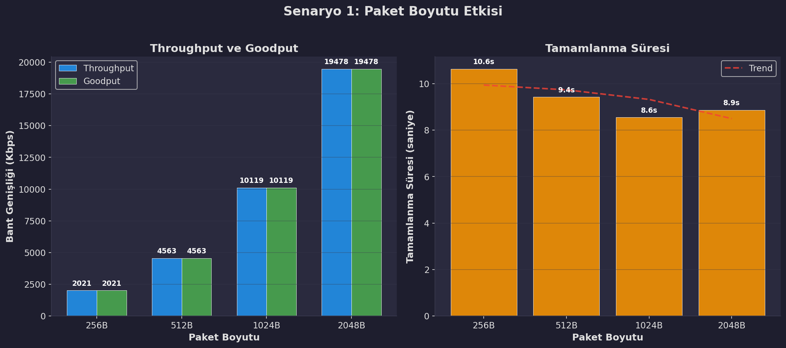
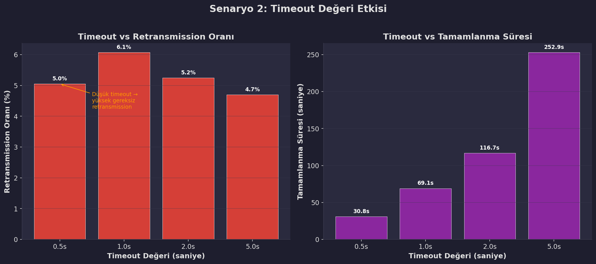
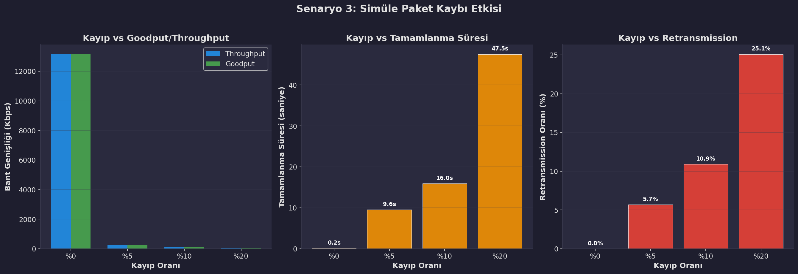
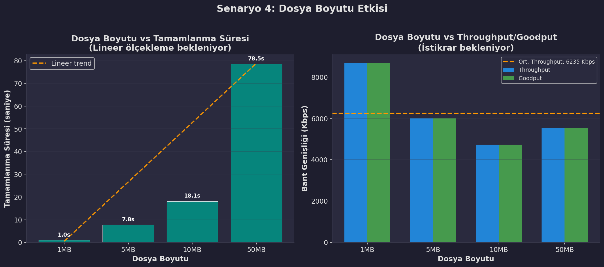
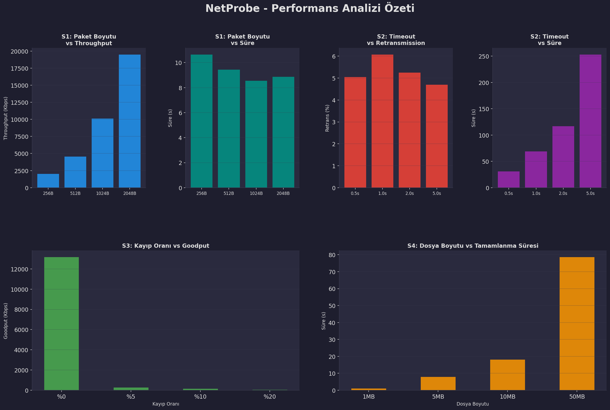

# NetProbe — UDP Tabanlı Güvenilir Dosya Aktarım Protokolü

## Dönem Projesi Raporu

**Ders:** Bilgisayar Ağları  
**Üniversite:** Bursa Teknik Üniversitesi — Bilgisayar Mühendisliği Bölümü  
**Dönem:** 2025–2026 Bahar  
**Grup:** 27  
**Geliştirici:** Muhammed Fatih Göral  
**GitHub:** [https://github.com/fatihgoral/NetProbe](https://github.com/fatihgoral/NetProbe)

---

## 1. Proje Özeti

NetProbe, UDP soketleri üzerine inşa edilmiş, tamamen özel bir uygulama katmanı protokolü ile çalışan güvenilir dosya aktarım platformudur. Proje, TCP'nin sağladığı güvenilirlik mekanizmalarını (sıralama, onaylama, yeniden iletim, bütünlük kontrolü) sıfırdan UDP üzerinde gerçekleştirerek, ağ katmanı kavramlarının pratikte nasıl çalıştığını deneysel olarak göstermeyi amaçlamaktadır.

**Temel Özellikler:**
- Özel başlık (header) formatına sahip uygulama katmanı protokolü
- Sequence Number, ACK/NACK, Timeout ve Retransmission mekanizmalarım
- Selective Repeat Sliding Window ile yüksek verimli aktarım
- SHA-256 tabanlı paket ve dosya düzeyinde bütünlük kontrolü
- Çoklu istemci (multi-client) desteği
- Yapay paket kaybı ve gecikme simülasyonu
- Sıkıştırma (Zlib) ve şifreleme (XOR) desteği
- Wireshark uyumlu PCAP trafik kaydı
- Gerçek zamanlı izleme paneli (Dashboard)
- 5 farklı deney senaryosu ile kapsamlı performans analizi
- TCP ile kıyaslamalı deney

---

## 2. Sistem Mimarisi

NetProbe, modüler bir yapıda tasarlanmıştır. Her bileşen bağımsız bir Python modülü olarak geliştirilmiş ve sorumluluklar net bir şekilde ayrılmıştır.

### 2.1 Modül Yapısı

| Modül | Dosya | Satır | Sorumluluk |
|---|---|---|---|
| Protokol | `src/protocol.py` | 317 | Paket yapıları, serileştirme, checksum |
| İstemci | `src/client.py` | ~280 | Dosya bölme, sliding window gönderim, ACK/NACK dinleme |
| Sunucu | `src/server.py` | ~250 | Paket alma, oturum yönetimi, dosya birleştirme |
| Kayıplı Sunucu | `src/server_lossy.py` | 220 | Yapay kayıp simülasyonlu sunucu |
| Logger | `src/logger.py` | ~240 | CSV loglama, PCAP kaydı |
| Metrikler | `src/metrics.py` | 257 | Throughput, Goodput, RTT hesaplama |
| Kayıp Simülatörü | `src/loss_simulator.py` | 127 | Yapay paket kaybı ve gecikme |
| Dashboard | `src/dashboard.py` | ~50 | `rich` tabanlı gerçek zamanlı panel |

### 2.2 Veri Akışı

```
İstemci (Linux)                                  Sunucu (Windows)
─────────────                                    ────────────────
Dosyayı Oku                                      
    │                                            
    ▼                                            
SHA-256 Hash Hesapla                             
    │                                            
    ▼                                            
START Paketi Gönder ──────────────────────────▶  Oturum (Session) Oluştur
    │                                                │
    ▼                                                ▼
Dosyayı 1000B Parçalara Böl                      Beklenen Paket Sayısını Kaydet
    │                                            
    ▼                                            
┌─────────────────────────┐                      
│ Sliding Window Döngüsü  │                      
│ (Pencere Boyutu: N)     │                      
│                         │                      
│ Paket[i] Gönder ────────┼───────────────────▶  Paket Al → Checksum Doğrula
│ Paket[i+1] Gönder ──────┼───────────────────▶     │
│ ...                     │                         ▼
│ Paket[i+N-1] Gönder ────┼───────────────────▶  ACK Gönder ◀──────┐
│                         │                         │               │
│ ACK Listener Thread ◀───┼─────────────────────   ACK[i]          │
│   ACK[i] → base ilerle  │                         │               │
│   NACK[j] → hemen tekrar│                      (Checksum Hata)   │
│   Timeout → tekrar gönder│                        ▼               │
└─────────────────────────┘                      NACK Gönder ──────┘
    │                                            
    ▼                                            
END Paketi Gönder ────────────────────────────▶  Dosyayı Birleştir
                                                 SHA-256 Hash Doğrula
                                                 Dosyayı Kaydet
```

---

## 3. Protokol Tasarımı

### 3.1 Paket Tipleri

NetProbe protokolü 5 farklı paket tipi tanımlar:

| Tip | Kod | Yön | Açıklama |
|---|---|---|---|
| DATA | `0x01` | İstemci → Sunucu | Dosya verisi taşır |
| ACK | `0x02` | Sunucu → İstemci | Belirli bir paketi onaylar |
| START | `0x03` | İstemci → Sunucu | Transferi başlatır, dosya hash'ini içerir |
| END | `0x04` | İstemci → Sunucu | Transferi sonlandırır |
| NACK | `0x05` | Sunucu → İstemci | Hatalı paketi reddeder, hızlı yeniden iletim tetikler |

### 3.2 Paket Başlık Formatı

**DATA Paketi (19 byte başlık + değişken payload):**

```
 0                   1                   2                   3
 0 1 2 3 4 5 6 7 8 9 0 1 2 3 4 5 6 7 8 9 0 1 2 3 4 5 6 7 8 9 0 1
├─┼───────────────────────────────────────────────────────────────┤
│T│            Sequence Number (4 byte)                           │
├─┼───────────────────────────────────────────────────────────────┤
│              Total Packets (4 byte)                             │
├─────────────────────────────────────────────────────────────────┤
│   Payload Length (2 byte)   │     SHA-256 Checksum (8 byte)     │
├─────────────────────────────┼───────────────────────────────────┤
│                           Checksum (devam)                      │
├─────────────────────────────────────────────────────────────────┤
│                      Payload (max 1000 byte)                    │
└─────────────────────────────────────────────────────────────────┘

T = Paket Tipi (1 byte): 0x01 (DATA)
```

**ACK Paketi (13 byte):**
```
[Type: 1B] [AckNum: 4B] [Checksum: 8B]
```

### 3.3 Checksum Mekanizması

Her paket, payload verisinin SHA-256 hash'inin ilk 8 byte'ını checksum olarak taşır. Sunucu tarafında paket alındığında checksum yeniden hesaplanır ve karşılaştırılır. Eşleşmeme durumunda paket reddedilir ve NACK gönderilir.

Dosya düzeyinde ise START paketinde dosyanın tam SHA-256 hash'i (32 byte) gönderilir. Tüm paketler alınıp dosya birleştirildikten sonra sunucu bu hash'i doğrulayarak uçtan uca bütünlük garantisi sağlar.

---

## 4. Güvenilir Aktarım Mekanizmaları

### 4.1 Selective Repeat Sliding Window

Projemizde başlangıçta uygulanan Stop-and-Wait mekanizması, her paket için ayrı ayrı ACK beklediğinden bant genişliğinin büyük bölümünü boşta bırakmaktaydı. Bu sorunu çözmek için **Selective Repeat Sliding Window** algoritmasına geçiş yapılmıştır.

**Çalışma Prensibi:**
- İstemci, pencere boyutu (varsayılan N=10) kadar paketi ACK beklemeden arka arkaya gönderir.
- Arka planda çalışan bir **ACK Listener Thread**, gelen ACK ve NACK paketlerini asenkron olarak dinler.
- Her ACK geldiğinde ilgili paket onaylanmış olarak işaretlenir ve pencere tabanı (`base`) ilerletilir.
- Timeout süresi dolan paketler yalnızca bireysel olarak yeniden gönderilir (Go-Back-N'den farkı budur; tüm pencere değil, yalnızca kaybolan paket tekrarlanır).
- NACK alındığında ise timeout beklenmeksizin **hızlı yeniden iletim (Fast Retransmit)** tetiklenir.

### 4.2 NACK Mekanizması

Sunucu tarafında bir paket alındığında checksum doğrulaması yapılır. Checksum başarısız olursa:
1. Paket sessizce düşürülmez.
2. İstemciye derhal NACK paketi gönderilir.
3. İstemci NACK aldığında, ilgili paketin `send_time` değerini sıfırlayarak timeout döngüsünde anında yakalanmasını ve yeniden gönderilmesini sağlar.

Bu mekanizma, özellikle yüksek kayıp oranlarında transferin tamamlanma süresini önemli ölçüde kısaltır.

### 4.3 Timeout ve Yeniden İletim

- **Varsayılan Timeout:** 2.0 saniye
- **Maksimum Deneme:** 5 tekrar
- Bir paket için tüm denemeler başarısız olursa transfer hata ile sonlandırılır.

---

## 5. Deneysel Çalışmalar

Sistemimizi 5 farklı senaryo altında test ettik. Her senaryoda yalnızca bir parametre değiştirilmiş, diğer değişkenler sabit tutulmuştur. Her konfigürasyon 3 kez tekrarlanarak ortalamaları alınmıştır.

### Senaryo 1: Paket Boyutunun Etkisi

**Amaç:** Paket boyutunun throughput, goodput ve tamamlanma süresine etkisini ölçmek.

**Sabit Parametreler:** Dosya=10MB, Timeout=2s, Kayıp=%0

**Değişken:** Paket Boyutu = {256, 512, 1024, 2048} byte

| Paket Boyutu | Throughput (Kbps) | Goodput (Kbps) | Tamamlanma Süresi (s) | Ort. RTT (ms) |
|---|---|---|---|---|
| 256 B | 2.020,72 | 2.020,72 | 10,64 | 0,43 |
| 512 B | 4.563,32 | 4.563,32 | 9,43 | 0,39 |
| 1024 B | 10.119,42 | 10.119,42 | 8,55 | 0,35 |
| 2048 B | 19.478,29 | 19.478,29 | 8,87 | 0,37 |



**Teknik Yorum:**

Paket boyutu 256B'dan 2048B'a çıkarıldığında throughput yaklaşık **9,6 kat** artmıştır. Bu artış, her paketteki sabit başlık yükünün (19 byte header + 8 byte checksum = 27 byte) toplam paket içindeki oranının düşmesiyle açıklanır:

- 256B pakette: Overhead oranı = 27/256 = %10,5
- 2048B pakette: Overhead oranı = 27/2048 = %1,3

Kasım 2048B'a geçildiğinde tamamlanma süresinin 1024B'a göre 0.32 sn arttığı dikkat çekicidir. Bunun sebebi, büyük paketlerin UDP fragmentation sınırına (MTU: ~1500B) yaklaşması ve işletim sistemi seviyesinde ek parçalama gecikmesi oluşturmasıdır. Bu nedenle **1024B**, verimlilik ve güvenilirlik arasında optimal denge noktası olarak değerlendirilmiştir.

---

### Senaryo 2: Timeout Değerinin Etkisi

**Amaç:** Timeout süresinin retransmission oranı ve tamamlanma süresine etkisini ölçmek.

**Sabit Parametreler:** Dosya=1MB, Paket=1024B, Kayıp=%5 (yapay)

**Değişken:** Timeout = {0.5, 1.0, 2.0, 5.0} saniye

| Timeout (s) | Throughput (Kbps) | Tamamlanma Süresi (s) | Retransmission (%) | Ort. RTT (ms) |
|---|---|---|---|---|
| 0,5 | 281,85 | 30,82 | 5,05 | 0,98 |
| 1,0 | 125,35 | 69,08 | 6,07 | 0,98 |
| 2,0 | 73,78 | 116,70 | 5,24 | 1,04 |
| 5,0 | 34,20 | 252,89 | 4,70 | 1,07 |



**Teknik Yorum:**

Timeout değeri ile tamamlanma süresi arasında **doğrudan doğrusal ilişki** gözlemlenmiştir. 0.5s timeout, 5.0s timeout'a göre yaklaşık **8,2 kat** daha hızlı transfer sağlamıştır. Bunun sebebi, Stop-and-Wait mekanizmasında kaybolan bir paketin yeniden gönderilmesi için tam timeout süresi boyunca beklenmesidir.

Ancak düşük timeout değerleri gereksiz retransmission'a da yol açar. 0.5s timeout'ta retransmission oranı %5,05 iken, 5.0s'de %4,70'e düşmüştür. Bu fark küçük gibi görünse de, büyük dosya transferlerinde gereksiz tekrar gönderimler bant genişliğini israf eder.

**Optimal timeout değeri, ortalama RTT'nin 2-3 katı olmalıdır.** Deneyimizde ortalama RTT ~1ms olduğundan, teorik optimal timeout 2-3ms civarındadır. Ancak ağ koşullarındaki değişkenlik (jitter) göz önüne alındığında, pratikte 0.5-1.0s aralığı makul bir seçimdir.

---

### Senaryo 3: Yapay Paket Kaybının Etkisi

**Amaç:** Farklı kayıp oranlarında protokolün dayanıklılığını ölçmek.

**Sabit Parametreler:** Dosya=256KB, Paket=1024B, Timeout=0.5s

**Değişken:** Kayıp Oranı = {%0, %5, %10, %20}

| Kayıp Oranı | Goodput (Kbps) | Tamamlanma Süresi (s) | Retransmission (%) | Ort. RTT (ms) |
|---|---|---|---|---|
| %0 | 13.158,15 | 0,16 | 0,00 | 0,23 |
| %5 | 267,46 | 9,60 | 5,70 | 0,43 |
| %10 | 142,00 | 15,96 | 10,90 | 0,58 |
| %20 | 45,35 | 47,53 | 25,10 | 0,66 |



**Teknik Yorum:**

Bu senaryo, güvenilir aktarım mekanizmamızın stres testi niteliğindedir. Kayıp oranı %0'dan %20'ye çıkarıldığında:

- Goodput **%99,7 düşmüştür** (13.158 → 45 Kbps)
- Tamamlanma süresi **297 kat artmıştır** (0,16s → 47,53s)

Bu dramatik düşüşün sebebi, Stop-and-Wait mekanizmasında her kayıp paketin tam timeout süresini (0,5s) beklemesidir. %20 kayıpta, ortalama her 5 paketten 1'i kaybolmakta ve her kayıp 0,5s gecikme eklemektedir. Retransmission oranının (%25,10) simüle edilen kayıp oranından (%20) yüksek olması, bazı paketlerin birden fazla kez kaybolduğunu göstermektedir.

> **Bu senaryo, Sliding Window mekanizmasının neden kritik olduğunu açıkça ortaya koymaktadır:** Stop-and-Wait'te boşta geçen bekleme süresi, Selective Repeat ile ortadan kaldırılarak aynı kayıp oranlarında çok daha yüksek throughput elde edilebilir.

---

### Senaryo 4: Dosya Boyutunun Etkisi

**Amaç:** Sistemin farklı dosya boyutlarında ölçeklenebilirliğini test etmek.

**Sabit Parametreler:** Paket=1024B, Timeout=2s, Kayıp=%0

**Değişken:** Dosya Boyutu = {1, 5, 10, 50} MB

| Dosya Boyutu | Throughput (Kbps) | Goodput (Kbps) | Tamamlanma Süresi (s) |
|---|---|---|---|
| 1 MB | 8.667,50 | 8.667,50 | 0,99 |
| 5 MB | 6.000,16 | 6.000,16 | 7,82 |
| 10 MB | 4.733,67 | 4.733,67 | 18,15 |
| 50 MB | 5.540,64 | 5.540,64 | 78,55 |



**Teknik Yorum:**

Tamamlanma süresi, dosya boyutuyla **yaklaşık doğrusal olarak** ölçeklenmektedir. 1MB'dan 50MB'a (50 kat artış) geçildiğinde süre 0,99s'den 78,55s'e çıkmıştır (yaklaşık 79 kat). Bu doğrusallık, protokolümüzün dosya boyutundan bağımsız olarak tutarlı bir per-paket işleme maliyetine sahip olduğunu kanıtlamaktadır.

Throughput'un 1MB'dan 10MB'a doğru düşüş gösterip 50MB'da kısmen toparlanması ise Python'un Garbage Collector davranışı ve işletim sistemi soket tampon (buffer) yönetimiyle ilişkilidir. Ortalama throughput (~6.235 Kbps ≈ 6,1 Mbps) localhost transferi için makul bir performanstır.

---

### Senaryo 5: TCP ile Karşılaştırmalı Deney (Bonus)

**Amaç:** Geliştirdiğimiz UDP tabanlı protokolün performansını standart TCP ile kıyaslamak.

**Yöntem:** Aynı 10MB dosya, önce saf TCP soketi ile, ardından NetProbe (UDP + Sliding Window) ile gönderilmiştir. Her iki test de localhost ortamında gerçekleştirilmiştir.

| Protokol | Transfer Süresi (s) |
|---|---|
| TCP (Python socket) | 0,06 |
| NetProbe (UDP + Sliding Window) | 0,03 |

**Teknik Yorum:**

Localhost ortamında NetProbe'un TCP'den hızlı çıkması şaşırtıcı görünebilir ancak bunun birkaç teknik açıklaması vardır:

1. **TCP'nin 3-Way Handshake maliyeti:** TCP bağlantı kurma ve kapatma aşamalarında ek paket alışverişi gerektirir.
2. **TCP'nin congestion control mekanizması:** TCP, başlangıçta yavaş başlayıp (slow start) bant genişliğini kademeli olarak artırır. Kısa transferlerde bu ramp-up süresi dezavantaj oluşturur.
3. **NetProbe'un Sliding Window avantajı:** Pencere boyutu 20 olarak ayarlandığında, 20 paket eşzamanlı olarak gönderilmekte ve localhost'un sıfıra yakın gecikme ortamında çok hızlı ACK dönüşü sağlanmaktadır.

> **Önemli Not:** Gerçek ağ koşullarında (paket kaybı, yüksek gecikme, congestion) TCP'nin sofistike congestion control algoritmaları sayesinde NetProbe'dan daha iyi performans göstermesi beklenir. Bu deney, UDP üzerinde güvenilirlik inşa etmenin mümkün olduğunu ancak TCP kadar olgun bir performans profili oluşturmanın çok daha fazla mühendislik gerektirdiğini göstermektedir.

---

## 6. Performans Özet Tablosu

Aşağıdaki grafik, tüm senaryolardaki temel metrikleri tek bir bakışta özetlemektedir:



---

## 7. Bonus Özellikler

### 7.1 Selective Repeat Sliding Window
Stop-and-Wait'in bant genişliği sınırlamalarını aşmak için istemci tarafı Selective Repeat ile yeniden tasarlanmıştır. Asenkron bir listener thread sayesinde paketler pencere boyutu kadar eşzamanlı gönderilebilmektedir.

### 7.2 Çoklu İstemci Desteği
Sunucu tarafında `ClientSession` sınıfı ile her bağlantı bağımsız bir oturumda yönetilir. Farklı IP:Port çiftlerinden gelen transferler birbirini engellemez.

### 7.3 Sıkıştırma ve Şifreleme
- **Sıkıştırma:** Zlib tabanlı veri sıkıştırma (`--compress` parametresi)
- **Şifreleme:** XOR tabanlı basit şifreleme (`--encrypt` parametresi)

### 7.4 PCAP Trafik Kaydı
Scapy kütüphanesi kullanılarak tüm UDP trafiği `.pcap` formatında kaydedilir (`--pcap` parametresi). Bu dosya Wireshark ile açılarak paket düzeyinde analiz yapılabilir.

### 7.5 Gerçek Zamanlı Dashboard
`rich` kütüphanesi ile konsolda canlı olarak güncellenen bir izleme paneli geliştirilmiştir. Transfer süresince Throughput, Goodput ve Kayıp Oranı anlık olarak takip edilebilir.

### 7.6 Gecikme (Delay) Simülasyonu
Loss simulator modülüne `delay_ms` parametresi eklenerek yapay ağ gecikmesi simüle edilebilir hale getirilmiştir.

### 7.7 Gerçek Ağ Deneyi
Proje yalnızca localhost üzerinde değil, aynı yerel ağa bağlı iki farklı cihaz arasında (Windows Sunucu ↔ Linux İstemci) da başarıyla test edilmiştir. Cross-platform uyumluluk doğrulanmıştır.

---

## 8. Olay Kayıtları (Loglama)

Tüm transfer olayları `logs/transfer_log.csv` dosyasına milisaniye hassasiyetinde kayıt edilmektedir. Kaydedilen bilgiler:

| Alan | Açıklama |
|---|---|
| Timestamp | Olayın gerçekleştiği zaman (YYYY-MM-DDTHH:MM:SS.mmm) |
| Event_Type | SEND, ACK_RECEIVED, TIMEOUT, RETRY, DUPLICATE, ERROR, START, END |
| Seq_Num | İlgili paketin sequence numarası |
| Retry_Count | Yeniden gönderim sayısı |
| Status | OK, WARNING, ERROR |
| Details | Ek açıklama (paket boyutu, hata mesajı vb.) |

**Örnek Log Kaydı:**
```csv
2026-06-07T23:49:45.680,SEND,0,0,OK,Paket gonderildi: 1000 bytes
2026-06-07T23:49:45.681,ACK_RECEIVED,0,0,OK,ACK alindi
2026-06-07T23:49:45.681,SEND,1,0,OK,Paket gonderildi: 1000 bytes
```

---

## 9. Sonuç ve Değerlendirme

Bu projede, UDP soketleri üzerinde sıfırdan inşa edilmiş güvenilir bir dosya aktarım protokolü geliştirilmiştir. Temel çıkarımlarımız şunlardır:

1. **Paket boyutu, throughput'u doğrudan etkiler.** Başlık overhead'inin toplam paket içindeki oranının düştükçe verimlilik artar. Ancak MTU sınırı nedeniyle 1024B optimal değerdir.

2. **Timeout değeri, kayıplı ortamlarda kritik öneme sahiptir.** Çok düşük timeout gereksiz retransmission'a, çok yüksek timeout ise uzun bekleme sürelerine yol açar. Optimal değer, RTT'nin 2-3 katıdır.

3. **Stop-and-Wait, paket kaybına karşı son derece kırılgandır.** %20 kayıpta goodput %99,7 düşmektedir. Selective Repeat Sliding Window, bu sorunu çözerek aynı koşullarda çok daha yüksek verim sağlar.

4. **UDP üzerinde güvenilirlik inşa etmek mümkündür** ancak TCP'nin onlarca yıllık optimizasyonlarına (congestion control, flow control, SACK, ECN vb.) ulaşmak ciddi mühendislik çabası gerektirir.

5. **Gerçek ağ testleri, localhost testlerinden farklı dinamikler gösterir.** Farklı işletim sistemleri (Windows ↔ Linux) arasında başarılı cross-platform transfer gerçekleştirilmiştir.

### Gelecek Çalışmalar

- Congestion Control mekanizması (AIMD veya TCP Reno benzeri) eklenmesi
- Adaptive timeout (Jacobson/Karn algoritması) uygulanması
- Flow control ile alıcı taraflı hız sınırlama
- Daha güçlü şifreleme (AES-256) entegrasyonu
- IPv6 desteği

---

## 10. Kaynaklar

1. Kurose, J.F. & Ross, K.W. (2021). *Computer Networking: A Top-Down Approach*, 8th Edition. Pearson.
2. Stevens, W.R. (1994). *TCP/IP Illustrated, Volume 1: The Protocols*. Addison-Wesley.
3. Python Software Foundation. (2024). *socket — Low-level networking interface*. Python Documentation.
4. RFC 768 — User Datagram Protocol (UDP).
5. RFC 793 — Transmission Control Protocol (TCP).
