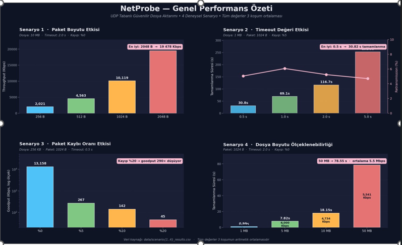
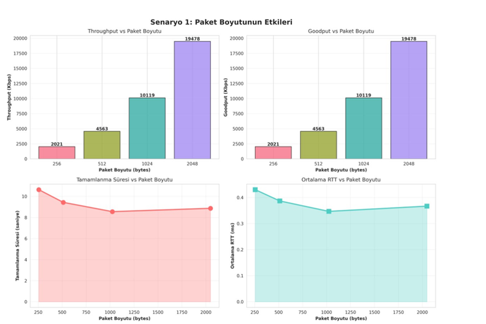
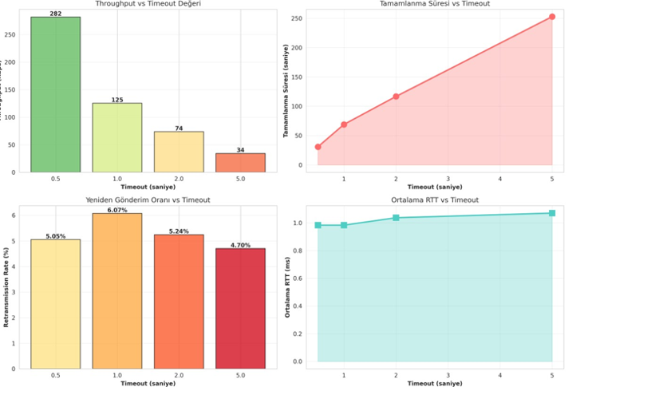
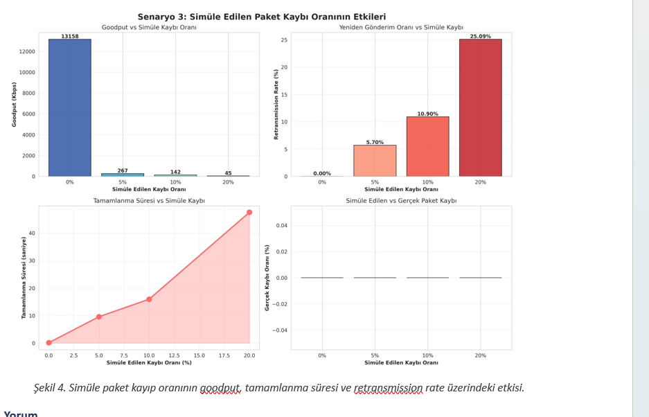
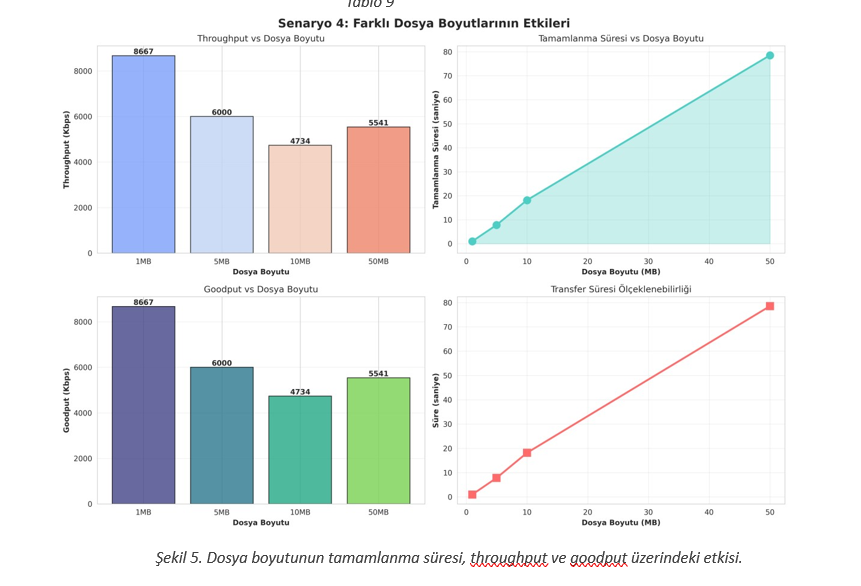

# 🌐 NetProbe

**UDP Tabanlı Güvenilir Dosya Aktarımı, Trafik İzleme ve Ağ Performans Analiz Platformu**

**Bursa Teknik Üniversitesi | Bilgisayar Mühendisliği Bölümü**
**Bilgisayar Ağları Dersi - Dönem Projesi**

**Geliştirici:** Muhammed Fatih Göral

---

# 📋 Proje Özeti

NetProbe, UDP üzerinde **stop-and-wait** yaklaşımı temelli güvenilir dosya aktarımı sağlayan; eş zamanlı olarak trafik kayıtlarını üreten ve sistem performansını farklı koşullar altında ölçen kapsamlı bir ağ platformudur.

Bu projenin temel amacı yalnızca çalışan bir dosya aktarım sistemi geliştirmek değil, aynı zamanda geliştirilen güvenilirlik mekanizmasının farklı ağ koşulları altındaki davranışını sayısal verilerle analiz etmektir. Paket boyutu, timeout süresi, kayıp oranı ve dosya boyutu gibi parametrelerin performans üzerindeki etkileri deneysel olarak incelenmiştir.




---

# ✨ Temel Özellikler ve Güvenilirlik Mekanizmaları

UDP’nin bağlantısız ve güvenilmez yapısını uygulama katmanında çözmek amacıyla aşağıdaki mekanizmalar geliştirilmiştir:

* **Sequence Number:**
  Her veri paketi benzersiz sıra numarası taşır. Böylece paket sıralaması korunur ve duplicate paketler tespit edilir.

* **ACK (Stop-and-Wait):**
  Gönderilen her veri paketi için alıcıdan onay (ACK) beklenir.

* **Timeout & Retransmission:**
  Beklenen ACK belirlenen süre içerisinde gelmezse paket yeniden gönderilir.

* **Checksum Doğrulaması:**
  Paket başlığında SHA-256 tabanlı checksum doğrulaması yapılır.

* **Uçtan Uca Bütünlük Kontrolü:**
  Dosyanın SHA-256 özeti aktarım sonunda tekrar hesaplanarak veri bütünlüğü doğrulanır.

* **Detaylı Olay Loglama:**
  Tüm ağ olayları milisaniye hassasiyetli zaman damgalarıyla kayıt altına alınır.

---

# 🏗️ Sistem Mimarisi ve Protokol

NetProbe; istemci, sunucu, protokol katmanı, log altyapısı ve kayıp simülatöründen oluşan modüler bir yapıya sahiptir.

## DATA Paketi (0x01)

```text
┌─────────────┬──────────┬─────────────┬──────────────┬───────────┬─────────────┐
│Packet Type  │ Seq Num  │Total Pkts   │Payload Len   │Checksum   │ Payload     │
│ 1 byte      │ 4 bytes  │ 4 bytes     │ 2 bytes      │ 8 bytes   │ max 1000B   │
└─────────────┴──────────┴─────────────┴──────────────┴───────────┴─────────────┘
```

Tam dolu bir paket yaklaşık 1019 bayt boyutundadır ve Ethernet MTU sınırı altında kalacak şekilde tasarlanmıştır.

---

## ACK Paketi (0x02)

```text
┌─────────────┬──────────┬───────────┐
│Packet Type  │ ACK Num  │ Checksum  │
│ 1 byte      │ 4 bytes  │ 8 bytes   │
└─────────────┴──────────┴───────────┘
```

---

# 🧪 Deneysel Senaryolar ve Performans Analizi

NetProbe sistemi farklı ağ koşullarını test eden deney senaryoları içermektedir. Throughput, Goodput, RTT, Completion Time ve Packet Loss gibi metrikler otomatik olarak hesaplanmaktadır.

---

# 1️⃣ Senaryo 1: Paket Boyutu Etkisi

Farklı paket boyutlarının sistem performansına etkisi incelenmiştir.




### Bulgular

* Paket boyutu arttıkça throughput değeri belirgin şekilde artmıştır.
* Küçük paketlerde protokol overhead maliyeti daha fazla hissedilmiştir.
* 1024 byte paket boyutu performans açısından en verimli değer olarak gözlemlenmiştir.
* Daha büyük paketlerde işlem yükü arttığı için tamamlanma süresi tekrar yükselme eğilimi göstermiştir.

---

# 2️⃣ Senaryo 2: Timeout Değeri Etkisi

Timeout süresinin performans üzerindeki etkisi ölçülmüştür.




### Bulgular

* Timeout süresi arttıkça throughput ciddi şekilde düşmüştür.
* Çok büyük timeout değerleri aktarım süresini gereksiz şekilde uzatmıştır.
* Çok küçük timeout değerleri ise gereksiz retransmission oluşturmuştur.
* En verimli timeout değeri, ortalama RTT’nin küçük bir katı olacak şekilde belirlenmelidir.

---

# 3️⃣ Senaryo 3: Simüle Paket Kaybı Etkisi

ACK paketleri düşürülerek yapay paket kaybı oluşturulmuştur.



### Bulgular

* Paket kaybı arttıkça stop-and-wait protokolünün performansı ciddi şekilde düşmüştür.
* Yüksek kayıp oranlarında throughput ve goodput dramatik şekilde azalmıştır.
* Tamamlanma süresi doğrusal değil, üstel şekilde büyüme göstermiştir.
* Stop-and-wait yaklaşımının paket kayıplarına karşı oldukça hassas olduğu gözlemlenmiştir.

---

# 4️⃣ Senaryo 4: Dosya Boyutu Ölçeklenebilirliği

Farklı dosya boyutlarının sistem davranışına etkisi incelenmiştir.


### Bulgular

* Tamamlanma süresi dosya boyutuyla neredeyse doğrusal şekilde artmıştır.
* Büyük dosyalarda throughput değerinde hafif düşüş gözlemlenmiştir.
* Bu düşüşün temel nedenleri:

  * Disk I/O maliyetleri
  * Python GIL etkisi
  * RTT bekleme süreleri
  * Artan paket sayısıdır.

---

# 🚀 Kurulum ve Kullanım

## Gereksinimler

* Python 3.11 veya daha yeni sürüm

Gerekli kütüphaneleri yüklemek için:

```bash
pip install -r requirements.txt
```

Not: Core sistem yalnızca Python standart kütüphanelerini kullanmaktadır. Pandas ve matplotlib gibi ek kütüphaneler yalnızca analiz ve grafik üretimi için gereklidir.

---

## 1. Sunucuyu Başlatma

```bash
python src/server.py --port 5000 --output-dir ./received_files
```

---

## 2. İstemci ile Dosya Gönderme

```bash
python src/client.py --host localhost --port 5000 --file data/test_10mb.bin --packet-size 1024 --timeout 2.0
```

---

## 3. Deney Senaryolarını Çalıştırma

```bash
python experiments/scenario1_packetsize.py
python experiments/scenario2_timeout.py
python experiments/scenario3_loss.py
python experiments/scenario4_filesize.py
```

Sonuçlar `data/` klasörüne CSV olarak kaydedilir ve grafikler `reports/graphics/` klasöründe oluşturulur.

---

# 🔮 Sonuç ve Gelecek Çalışmalar

NetProbe, UDP üzerinde güvenilir veri aktarımını başarıyla gerçekleştirmiş ve stop-and-wait yaklaşımının güçlü ve zayıf yönlerini deneysel sonuçlarla ortaya koymuştur.

Gerçekleştirilen testler sonucunda:

* Paket kaybının performansı ciddi şekilde etkilediği,
* Timeout ayarının kritik öneme sahip olduğu,
* Paket boyutunun throughput üzerinde doğrudan etkili olduğu,
* Büyük dosyalarda doğrusal ölçeklenebilirliğin büyük ölçüde korunduğu gözlemlenmiştir.

Gelecek çalışmalarda aşağıdaki geliştirmelerin yapılması planlanmaktadır:

* Sliding Window tabanlı Go-Back-N veya Selective Repeat yapısına geçilmesi
* Adaptif RTO hesaplaması için Jacobson–Karels algoritmasının kullanılması
* Çoklu istemci desteği
* Uçtan uca şifreleme mekanizması eklenmesi
* Gerçek zamanlı trafik izleme paneli geliştirilmesi

---

#  GİTHUB REPO BAGLANTISI : https://github.com/fatihgoral/NetProbe


# 📄 Lisans

Bu proje, Bursa Teknik Üniversitesi Bilgisayar Ağları dersi kapsamında geliştirilmiş akademik bir çalışmadır.
GİTHUB REPO BAGLANTISI : https://github.com/fatihgoral/NetProbe

**Tarih:** Bahar 2026
